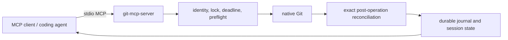

# Public architecture

`git-mcp-server` exposes a constrained local MCP surface. It operates on a
trusted repository through native Git and records durable operation state for
recovery; it is not a hosted service or general command runner.

Every mutation binds expected repository state, receives a request ID, and is
reconciled before its terminal durable result is returned. Use
[`git_operation_get`](../README.md#tools) to recover a result after an
interrupted transport without repeating the mutation.
