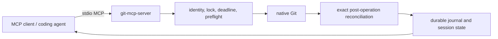

# Public architecture

`git-mcp-server` exposes a constrained local MCP surface. It operates on a
trusted repository through native Git and records durable operation state for
recovery; it is not a hosted service or general command runner.

Every mutation binds expected repository state, receives a request ID, and is
reconciled before its terminal durable result is returned. Use
[`git_operation_get`](../README.md#tools) to recover a result after an
interrupted transport without repeating the mutation.

## Existing local branch attachment

`git_switch_attach` is a narrow branch-state mutation for a managed worktree
that is already detached at the commit claimed by an existing local branch.
Its strict input binds `expected_branch: null`, the exact current
`expected_head`, a canonical local `branch` name, and the exact
`expected_branch_head`.

Under the common-gitdir repository lock, preflight proves repository identity,
operation state `none`, no active bridge session, an index equal to HEAD, a
completely clean worktree, target ref existence and exact HEAD, equality of
target and current HEAD, and absence of any other worktree checkout of the
target branch. Before evidence contains only the detached state, index proof,
requested target branch, and target object ID; discovered worktree paths and
native diagnostics are never returned or persisted.

The sole mutation is `git switch --no-guess <branch>`. Branch creation, reset, force,
remote access, implicit dirty-state preservation, and arbitrary ref checkout
are outside the operation. Postflight reconciles the attached branch, unchanged
HEAD and index, operation state, identity, and clean worktree before a durable
success is returned.

## Commit-history validation and repair design

Commit history sometimes fails a repository policy only after it has been
published. The bridge needs two distinct recovery routes: retain the current
branch name when its remote history may be replaced, or create a replacement
branch without changing the original branch. Force-push permission belongs to
the caller and its MCP approval policy, not to a bridge-level branch-name rule.
The bridge still constrains every operation to exact repository state and one
typed Git effect.

### Validate a commit range

`git_commit_range_validate` validates every commit message in an explicitly
bounded, linear `base..head` range using the repository's native `commit-msg`
hook. Its input binds the canonical repository, client-generated request ID,
current branch, current HEAD, and full base object ID. The base must be an
ancestor of HEAD, the range must be non-empty and contain no merge commits, and
the repository must have no active Git operation or bridge session.

Hooks execute as trusted repository code, so this is a journaled mutation-class
operation even though its intended Git effect is validation. Preflight records
the exact ref, index, and complete worktree state. A rejected hook produces the
bounded `HOOK_FAILED` contract without persisting stdout, stderr, exit status,
message content, or temporary paths. Any hook-created index, worktree, or ref
change prevents a successful validation result. Success records the validated
base, head, commit count, and hook policy in `observed_before` and
`observed_after` evidence.

### Reword an exact range

`git_reword` recreates an explicitly listed linear `base..head` range with new
messages. The caller supplies the complete ordered old-commit/message mapping
and chooses one destination:

- `current_branch` moves only the current local branch from the expected old
  HEAD to the recreated HEAD.
- `new_branch` creates and switches to one named local branch while leaving the
  source branch unchanged.

The operation rejects detached HEAD, dirty tracked or untracked state, active
Git operations, active bridge sessions, missing or moved commits, incomplete or
out-of-order mappings, merge commits, signed commits, unsupported commit
headers, and destination-branch collisions. Messages are bounded, validated as
well-formed Unicode, passed on standard input, checked by the native
`commit-msg` hook, and redacted from the durable request record. Request hashes
continue to bind the original unredacted input for idempotent replay.

Each recreated commit retains the original tree, author, committer, and
supported metadata while mapping its parent to the preceding recreated commit.
Signing is `disabled_by_policy`; a signed source commit is rejected instead of
silently losing its signature. Before moving a ref, the bridge proves pairwise
tree equality for every old/new commit and final-tree equality for the old and
new heads. The local ref update uses an exact old-object compare-and-swap and
keeps native reference-transaction hooks enabled. The operation never accesses
a remote, stashes changes, accepts raw Git arguments, or deletes a branch.

Postflight proves the selected destination branch and new HEAD, the unchanged
index and complete worktree snapshot, pairwise tree equality, and the source
branch outcome. The result reports only object IDs, counts, destination mode,
hook policy, signing policy, and before/after evidence; commit messages are not
returned or persisted.

### Amend the current commit

`git_commit_amend` replaces only the exact current HEAD using an owned normal
stage session. Its input binds repository, request ID, current branch, current
HEAD, stage ID, complete worktree snapshot ID, and the full replacement
message. The stage record must own the exact current index. Unstaged changes may
remain only when the supplied complete snapshot still matches; they are never
included implicitly.

The native amend runs `pre-commit` and `commit-msg` hooks, preserves the current
commit's parent set, commits exactly the owned index tree, and keeps signing
`disabled_by_policy`. Signed current commits are rejected instead of silently
downgraded. Hook rejection retains the stage session under the same exact index
guards. Postflight reports the old and new commit and tree IDs, hook-created
path evidence, signing policy, and unchanged unowned worktree state. It does
not stage files, amend another commit, push, stash, or accept arbitrary commit
options.

### Force-with-lease delivery

`git_push_force_with_lease` exposes force delivery as a separate destructive
MCP tool so clients and users can apply a distinct approval policy. The bridge
does not reject the operation because of the branch name or because the update
is non-fast-forward. Its input binds the canonical repository, request ID,
current local branch, exact local HEAD, and exact expected remote HEAD. The only
destination is the same branch name on `origin`.

Under the repository lock, preflight refreshes and compares the destination ref
to the expected remote object. The native push uses an internal exact
`--force-with-lease=<branch>:<expected>` and a fixed same-branch destination.
Caller-supplied refspecs, remote names, raw force flags, tag updates, remote
branch deletion, and automatic retry remain outside the contract. Remote drift
therefore rejects before replacement; after an interrupted transport, the
bridge reconciles the exact local and remote object IDs before publishing a
terminal or indeterminate result.

The existing fast-forward-only `git_push` remains unchanged. This additive tool
keeps its schema and non-destructive approval behavior backward compatible
while allowing callers that explicitly authorize history replacement to use a
separate, auditable route.

### Security and verification boundary

These operations preserve the existing trusted-repository threat boundary.
Native hooks and credential helpers may execute code with the user's operating
system authority; the bridge redacts their diagnostics but is not their
sandbox. Repository identity, common-gitdir locking, client-generated request
IDs, deadlines, durable replay, bounded inputs and outputs, and exact
`observed_before`/`observed_after` reconciliation apply to every new mutation.

Integration coverage must exercise real native Git and hooks for accepted and
rejected ranges, message redaction, dirty and detached repositories, active Git
and bridge sessions, branch collisions, signed and merge commits, tree and
metadata invariance, stage ownership, amend hook changes, exact remote CAS,
remote drift, interrupted force delivery, operation replay, and package-level
MCP schema discovery. Security review must confirm that no raw command,
arbitrary refspec, implicit stash, branch deletion, hook bypass, message leak,
or unguarded remote replacement is reachable.
