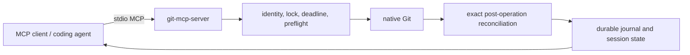

# Public architecture

`git-mcp-server` exposes a constrained local MCP surface. It operates on a
trusted repository through native Git and records durable operation state for
recovery; it is not a hosted service or general command runner.

Every mutation binds expected repository state, receives a request ID, and is
reconciled before its terminal durable result is returned. Use
[`git_operation_get`](../README.md#tools) to recover a result after an
interrupted transport without repeating the mutation.

## Existing local branch attachment

`git_switch_attach` is a narrow branch-state mutation for a managed worktree
that is already detached at the commit claimed by an existing local branch.
Its strict input binds `expected_branch: null`, the exact current
`expected_head`, a canonical local `branch` name, and the exact
`expected_branch_head`.

Under the common-gitdir repository lock, preflight proves repository identity,
operation state `none`, no active bridge session, an index equal to HEAD, a
completely clean worktree, target ref existence and exact HEAD, equality of
target and current HEAD, and absence of any other worktree checkout of the
target branch. Before evidence contains only the detached state, index proof,
requested target branch, and target object ID; discovered worktree paths and
native diagnostics are never returned or persisted.

The sole mutation is `git switch --no-guess <branch>`. Branch creation, reset, force,
remote access, implicit dirty-state preservation, and arbitrary ref checkout
are outside the operation. Postflight reconciles the attached branch, unchanged
HEAD and index, operation state, identity, and clean worktree before a durable
success is returned.
